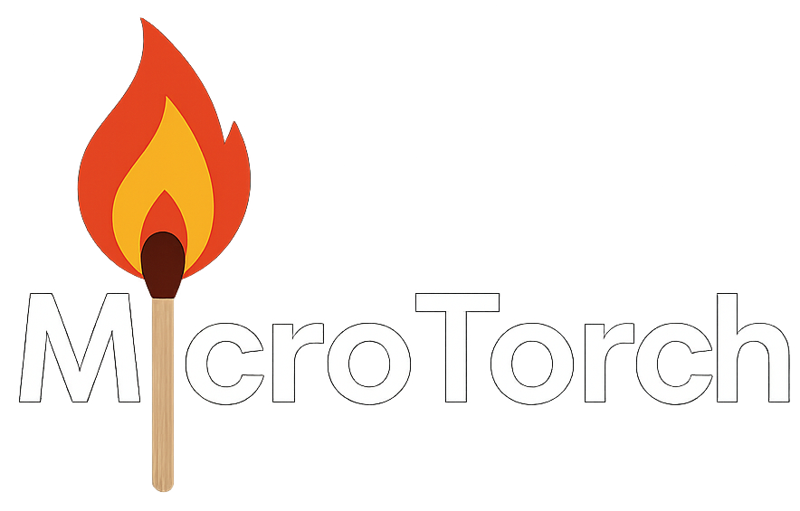

# MicroTorch

**MicroTorch** is a lightweight **automatic differentiation library** with **CPU and GPU support**, built on top of `NumPy` and `CuPy`. It enables efficient tensor computations, gradient tracking, and model building using a PyTorch-like API.



---

## 🚀 Features

- **Automatic Differentiation**: Supports backpropagation with dynamic computation graphs.
- **Neural Network Modules**: Easily build MLPs using modular layers, activations, and loss functions.
- **Optimizers**: Includes SGD and a flexible optimizer interface.
- **Backend Support**: Switch seamlessly between `NumPy` (CPU) and `CuPy` (GPU).
- **Tensor Ops**: Reshape, transpose, broadcasting, elementwise math, and more.
- **Testing and Extensibility**: Fully modular for research and educational use.

---

## Learn Deep Learning by Building It

Dive into the fundamentals of **backpropagation** and the mechanics of modern deep learning as you follow the development of **MicroTorch** — a minimalist, PyTorch-inspired framework built from scratch.

This hands-on YouTube series walks you through the core building blocks of a deep learning engine, including:

* Efficient **tensor operations**
* **Automatic differentiation** from first principles
* Implementing **activation functions**, **losses**, and **gradient-based optimization**

Whether you're a curious learner or an experienced developer seeking to demystify the internals of libraries like PyTorch, this series offers clear, incremental explanations and real code that brings each concept to life.

Start watching here:
📺 [MicroTorch: Full Development Process – YouTube Playlist](https://www.youtube.com/playlist?list=PLWUV973D6J8imrTO4yJk3aI0NKJZgzFeG)

---

## 📦 Installation

```bash
pip install numpy matplotlib
pip install cupy  # Optional: for GPU support via CUDA
```

---

## 🧪 Spiral Dataset MLP Demo

🧾 [**Try the Notebook** → `demo.ipynb`](./demo.ipynb)

Train a neural network to classify a spiral-shaped dataset using `microtorch`. Demonstrates the entire training loop including:

* Dataset generation with `make_spiral_dataset`
* MLP model built with `Linear`, `Tanh`, and `Sequential`
* Forward pass → MSE loss → Backpropagation → SGD updates
* Final decision boundary visualization using `matplotlib`

---

## 🔤 Usage Examples

### Tensor Initialization

```python
from microtorch import Tensor

x = Tensor.randn((3, 3), requires_grad=True)
y = Tensor.randn((3, 3), requires_grad=True)
```

### Forward & Backward Computation

```python
z = x * y + x**2 - y
z.backward()

print(x.grad)
print(y.grad)
```

### 🔹 Tensor Operations

```python
x.view((9,))
x.T
x @ y
x.sum()
x.mean()
x.log()
x.tanh()
x.squeeze()
x.unsqueeze()
```

---

## 🧠 Neural Network Module (`microtorch.nn`)

The `nn` subpackage provides tools to build and train neural networks using a modular structure similar to PyTorch.

### Key Components

| Category        | Modules                                            |
| --------------- | -------------------------------------------------- |
| **Core**        | `Module`, `Parameter`, `Sequential`                |
| **Layers**      | `Linear` (supports 2D and 3D inputs)               |
| **Activations** | `Tanh`                                             |
| **Losses**      | `MSELoss`, `L1Loss`, `CrossEntropyLoss`, `BCELoss` |
| **Optimizers**  | `SGD`, base `Optimizer` class                      |

---

### Example: Custom MLP with Training Step

```python
from microtorch.nn import Module, Linear, Tanh, MSELoss
from microtorch.nn.optimizer import SGD
from microtorch import Tensor

class SimpleModel(Module):
    def __init__(self):
        super().__init__()
        self.fc = Linear(2, 1)
        self.act = Tanh()

    def forward(self, x):
        return self.act(self.fc(x))

model = SimpleModel()
loss_fn = MSELoss()
optimizer = SGD(model.parameters, lr=0.01)

# Example training step
x = Tensor([0.5, -0.2], requires_grad=False)
y = Tensor([1.0])

pred = model(x)
loss = loss_fn(pred, y)
loss.backward()
optimizer.step()
```

---

## 🖥️ CPU & GPU Support

MicroTorch supports:

* **CPU** backend using `NumPy`
* **GPU** backend using `CuPy`

```python
x = Tensor.randn((32, 32), device="cuda")  # CUDA backend via CuPy
y = x.to("cpu")  # Move back to NumPy
```

Device handling is automatic and works seamlessly through the computation graph.

---

## Development & Contribution

MicroTorch is designed for learning, research, and customization. Contributions are welcome via pull requests!

To run tests:

```bash
pytest ./tests
```

---

## 📚 License

MIT License. © 2024-present.

---

## ⭐ Credits

Inspired by PyTorch's elegant API and driven by the desire to understand the internals of autograd, tensors, and neural network training from scratch.
